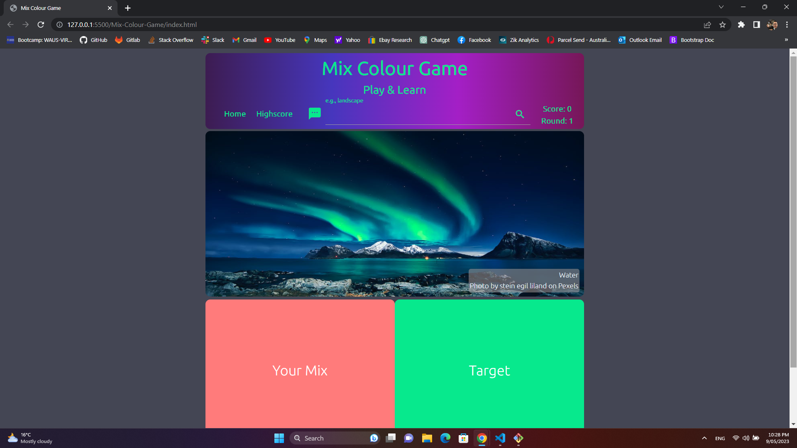

# Mix-Colour-Game
### A mix colour game to increase kids' sensitivity to colours and their applications in daily life.

# Deployed Link
https://paichienfeng.github.io/Mix-Colour-Game/

# Screenshots

.png)
.png)
.png)
.png)
.png)

# Concepts
### It’s a mix colour game for kids above 5 years old, but it can be for adults, too. In the game, you will be given a target colour, and 4 different colours to choose from, 2 of the 4 will be the correct answer. E.g., target: orange, correct mix: yellow and red.

# User Story
### As parents, we need a good way for kids to play and learn at the same time, which gives us more of our own time and it attracts kids' attentions by playing & learning rather than just watching shows on device.

# How to Play 
### After starting, there will be a randomly generated photo, and  Target section will show the main colour of the photo; Your-Mix is the section that shows the colour you pick and the mixture of the 2 colours you pick. The goal is to get the 2 correct colours to be mixed to Target colour. E.g., Target: orange; correct mix: yellow and red. There will be 10 rounds.

# Usage
### 1. You can search for any other topics you like during the game, all photos are from Pexels, a website storing millions of free fine photos. The default is nature.
### 2. All texts colour in header, Alldone, and Highscore sections change when a new photo is generated, the colour is the same as main photo/Target colour. 
### 3. When Target colour is too bright, the backgound colour in header, Alldone, Highscore sections will change to darker mode for users to see easily.
### 4. When the 1st pick is correct, and 2nd pick is wrong, you can see the mixture colour of your 2 picks for comparison with Target colour.
### 5. A fun gif of showing correct or wrong is displayed after choices made.
### 6. Score and round are shown on top right corner.
### 7. A link at bottom right of the phot shows the theme of the photo and the photographer's name, the link is directed to the photographer's works on Pexels.
### 8. Type in your initials for records if you get over 10 points.

## Enjoy!

